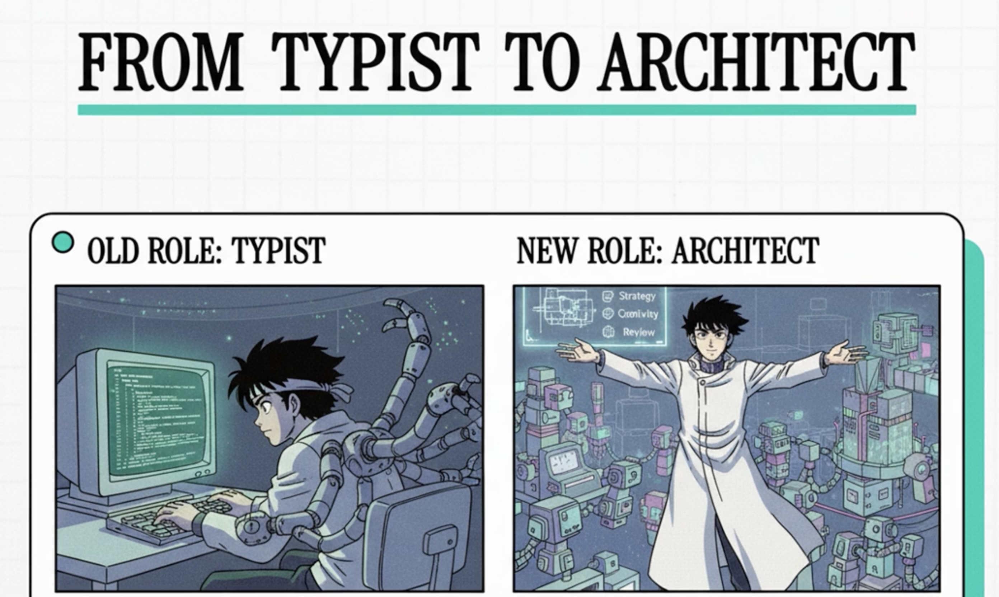
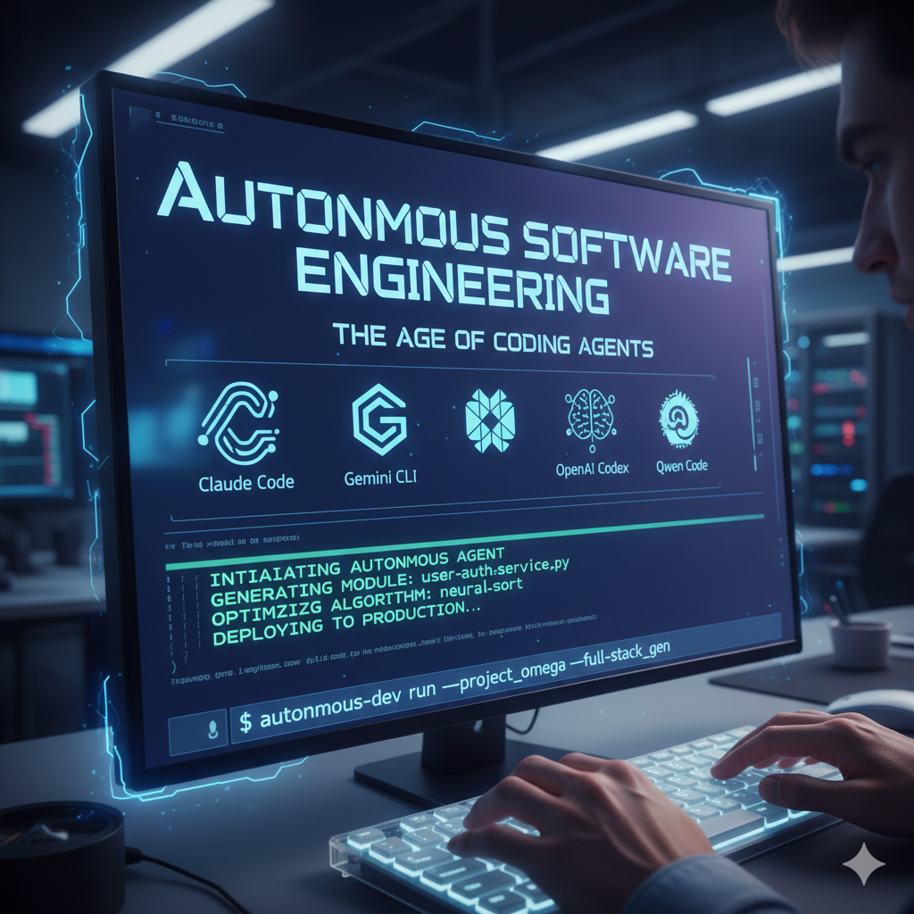
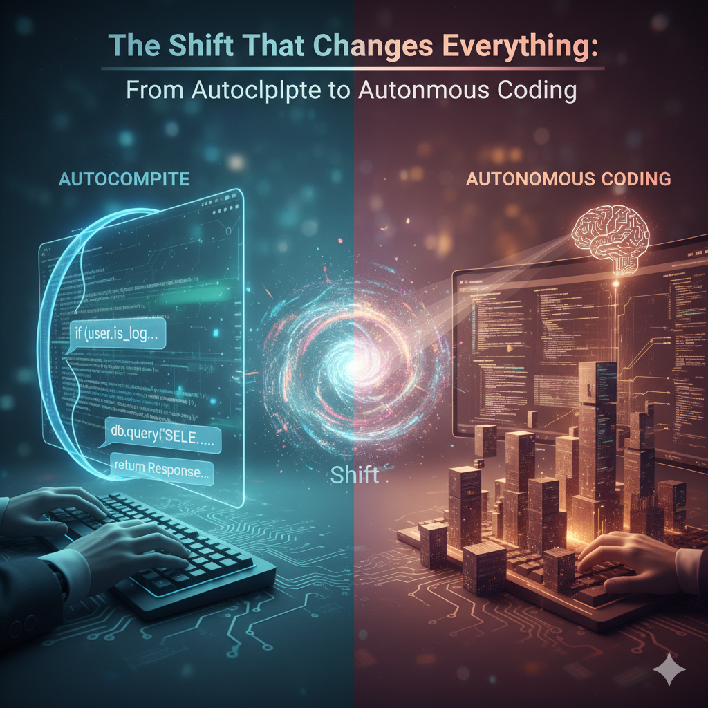
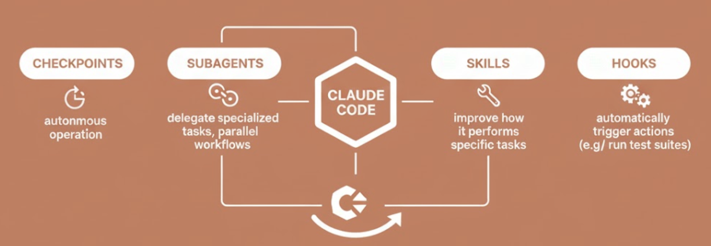
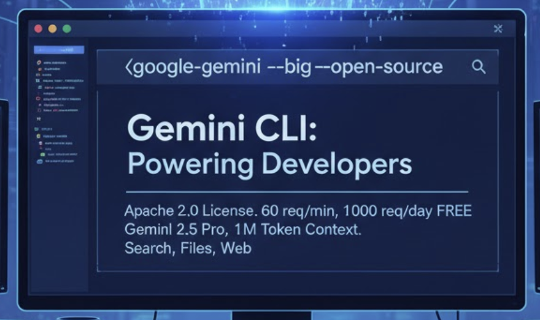
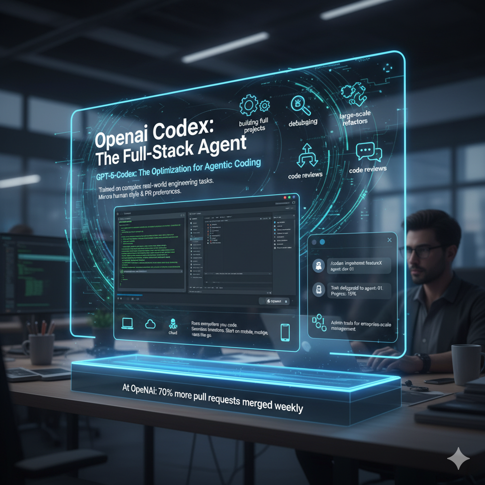
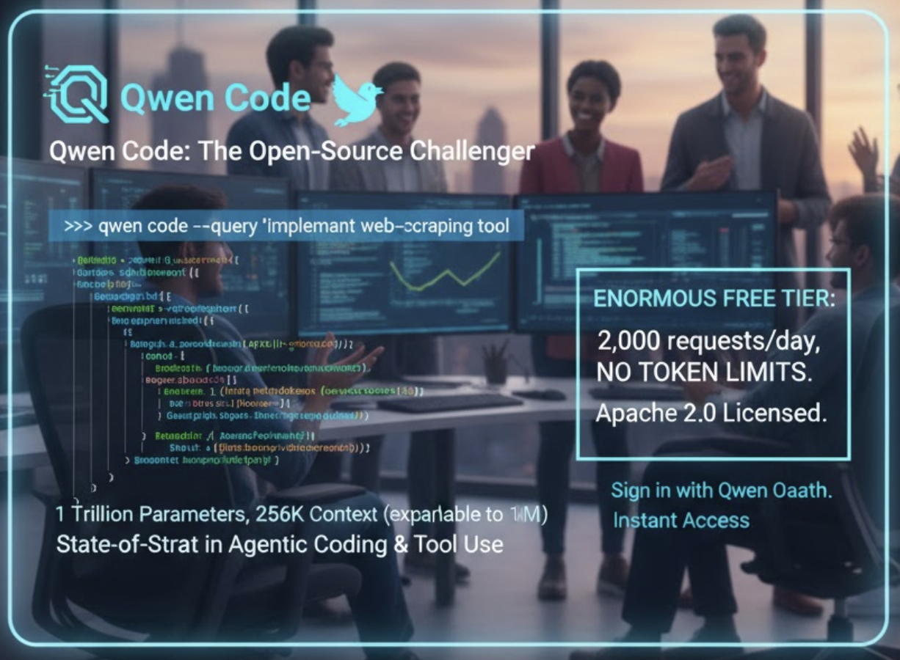

# The New Wave of AI Coding Agents Has Changed Everything for Developers
**The AI Coding Revolution: From Typist To Architect**

**[Overview Video in English](https://youtu.be/9wY2BSvonUI)**

**[Overview Video in Urdu/Hindi](https://youtu.be/rIbPbtLa9aE)**

In the past year, a radical shift has swept through software development. A new class of AI tools – often called AI coding agents or “agentic” CLI assistants – has burst onto the scene, turning our command-line terminals and editors into collaborative partners. Professional developers are discovering that coding is no longer just about typing out every line by hand, but about orchestrating work with a powerful AI sidekick. As Boris Cherny, creator of Anthropic’s Claude Code, put it: “Now when you code, you use an agent. You don’t directly manipulate text in an IDE anymore… it’s about the model writing code for you.”

**This profound change in how we build software isn’t just incremental – it’s a revolution in the making.**

AI coding agents are fundamentally transforming software development. What started with Claude Code has exploded into an ecosystem where Gemini CLI, OpenAI Codex, and Qwen Code are empowering developers to work at unprecedented speeds. This isn't autocomplete—it's autonomous software engineering living in your terminal.

---

## The Shift That Changes Everything: From Autocomplete to Autonomous Coding

Remember when AI coding tools were just fancy autocomplete? Those days are over.

The current generation of AI coding assistants allows developers to create agents that operate autonomously, handling entire coding tasks from start to finish. We're not talking about finishing lines of code—we're talking about agents that can refactor entire features, debug complex issues, run test suites, and even submit pull requests while you focus on the next challenge.

This is the agentic revolution, and it's happening right now in your terminal.

## How It All Started: The Claude Code Phenomenon

**[Claude Code Creator: We Didn't Mean to Build It, But It's Changed Everything](https://www.pcmag.com/news/claude-code-creator-we-didnt-mean-to-build-it-but-its-changed-everything)**

Often [credited as the trailblazer](https://www.startuphub.ai/ai-news/ai-video/2025/claude-code-ushers-in-a-new-era-of-agentic-programming/), Claude Code started as a command-line AI assistant built around Anthropic’s Claude model. It quickly proved so useful that even its creators were surprised – they “didn’t mean to build it” exactly, but it took on a life of its own and “changed everything” about how they code. Claude Code can read and modify large codebases, generate and edit files, and even use tools or access a browser through a safe interface. Initially available as a terminal-based tool for pros, it’s now accessible via the web to anyone, reflecting its broad appeal. Developers praise Claude Code for its polished, reliable performance (it’s known as an extremely fast and stable agent for complex coding tasks). In short, it’s like having an ultra-smart pair programmer who doesn’t just advise – it executes on your behalf.

Anthropic claims that approximately 90% of Claude Code itself was written by their own AI models, which tells you everything you need to know about where we're heading. The engineers at Anthropic rarely touch keyboards to write code anymore—they've become reviewers and orchestrators.

Claude Code didn't just introduce a new tool; it validated an entirely new paradigm for software development. Launched initially as a command-line interface and now available via web interface and mobile apps, Claude Code enables developers to delegate multiple coding tasks that run on cloud infrastructure. You can kick off several parallel tasks, each in its own isolated environment, and the agent handles implementation while you track progress in real-time.

The magic? You stay in control with approval modes ranging from full manual review to autonomous execution. Claude Code now features **checkpoints** for autonomous operation, **subagents** that delegate specialized tasks for parallel workflows, **Skills** to improve how it performs specific tasks, and **hooks** that automatically trigger actions at specific points like running test suites after code changes.

Read our discussion on how [Anthropic’s Skills concept, subagents, and the Model Context Protocol (MCP) fit together](
https://github.com/panaversity/spec-kit-plus/blob/main/docs-plus/02_composable_agent_architectures/readme.md), and become the main reusable abstraction.

## The Competitors That Raised The Bar

### Google Gemini CLI: Open Source and Everywhere

Google didn't just follow—they went big. Gemini CLI is fully open source under Apache 2.0 license, bringing the power of Gemini directly into developers' terminals with built-in tools for Google Search grounding, file operations, shell commands, and web fetching.

What makes Gemini CLI particularly compelling is its accessibility. Developers get 60 model requests per minute and 1,000 requests per day at no charge simply by logging in with a personal Google account. That's roughly double the average number of requests developers typically make, according to Google.

The tool uses Gemini 2.5 Pro with its massive 1 million token context window, meaning you can feed it entire codebases for comprehensive analysis. It's built on the Model Context Protocol (MCP), making it extensible with custom tools and integrations.

The best part? Gemini Code Assist's agent mode analyzes your entire codebase, proposes detailed plans, and awaits your approval before making changes. You're not just getting code generation—you're getting strategic thinking.

### OpenAI Codex: The Full-Stack Agent

GPT-5-Codex, released as a optimization for agentic coding, was specifically trained on complex real-world engineering tasks including building full projects from scratch, adding features and tests, debugging, performing large-scale refactors, and conducting code reviews. Codex generates code that closely mirrors human style and PR preferences.

Codex runs everywhere you code—terminal, IDE, cloud, GitHub, and even on your phone, with seamless transitions between your local environment and cloud sandboxes. Start a task from your mobile device, review progress, and merge changes on the go.

The standout feature? Codex has evolved with a Slack integration for delegating tasks directly from team channels, an SDK for embedding agents into custom workflows, and admin tools for enterprise-scale management. At OpenAI itself, nearly all engineers now use Codex, merging 70% more pull requests each week.

### Qwen Code: The Open-Source Challenger

China's Alibaba Cloud entered the arena with Qwen3-Coder, and developers are taking notice. Qwen3-Coder is a 1 Trillion parameter model with 35 billion active parameters, supporting 256K token context natively and expandable to 1M tokens, achieving state-of-the-art results among open models on agentic coding, browser use, and tool use.

Qwen Code is open-sourced as a command-line tool forked from Gemini CLI and adapted with customized prompts and function calling protocols specifically for Qwen3-Coder models. The training methodology is particularly impressive: Alibaba built a scalable system capable of running 20,000 independent environments in parallel on their cloud infrastructure to generate training data through reinforcement learning.

What truly sets Qwen Code apart is its enormous free tier: 2,000 requests per day with no token limits  and 60 requests per minute rate limit  when you sign in with Qwen OAuth. Credentials are cached automatically and managed seamlessly , making it accessible to any developer in under a minute. The community response? Enthusiastic. Developers report excellent results, particularly praising its cost-effectiveness compared to proprietary alternatives. And because Qwen Code is Apache 2.0 licensed, you can inspect every line, customize it for your needs, and deploy it however you want—all while enjoying what may be the most generous free tier in AI coding tools.

## Why This Changes Everything

### 1. **Developers Become Orchestrators**

Engineers using modern AI coding tools have transitioned from hands-on coding to supervising AI agents. You're no longer writing every function—you're describing what you need and reviewing intelligent implementations. Your role shifts from typist to architect.

### 2. **Parallel Workflows Become Reality**

Cloud-based sessions allow developers to run multiple tasks in parallel across different repositories from a single interface. While one agent refactors your authentication system, another can be writing tests for your API endpoints, and a third can be updating documentation. Three weeks of work compressed into an afternoon.

### 3. **Context Windows That Actually Matter**

Remember struggling to explain your codebase context to an AI? Those days are fading. With context windows reaching 256K to 1M tokens, these agents can understand your entire application architecture, legacy decisions, and coding patterns. They don't just know syntax—they understand your specific project.

### 4. **Test-Driven Development on Steroids**

A favorite workflow among developers is asking Claude to write tests based on expected input/output pairs using test-driven development, explicitly confirming tests fail before implementation, then having the agent iterate until all tests pass. The agent runs tests repeatedly, adjusts code, and doesn't stop until everything works. It's like having an infinitely patient pair programming partner.

### 5. **Real-Time Collaboration Meets Async Power**

Modern coding agents allow seamless switching between real-time collaboration and asynchronous delegation. Brainstorm with your AI agent in the terminal for five minutes, then let it run autonomously for an hour while you're in meetings. Come back to a pull request ready for review.

## The Numbers Don't Lie

The adoption metrics are staggering:

- Daily usage of OpenAI's Codex has grown by more than 10x since early August 2025, with GPT-5-Codex serving over 40 trillion tokens in its first three weeks
- On SWE-Bench evaluations, codex-1 achieves results showing strong performance even without configuration files or custom scaffolding
- Qwen3-Coder achieves state-of-the-art performance among open-source models on SWE-Bench Verified without test-time scaling

These aren't incremental improvements. These are revolutionary leaps.

## The Developer Experience Revolution

### Terminal-First Design

All these tools embrace terminal-native workflows. Developers describe the terminal as home—a place of efficiency, ubiquity, and portability that makes it the go-to utility for getting work done. These AI agents meet developers where they already work, eliminating context switching.

### Extensibility Through Standards

The adoption of Model Context Protocol (MCP) allows developers to configure custom MCP servers for integrating with external databases, GitHub, Slack, and other tools. Your agent isn't isolated—it's connected to your entire development ecosystem.

### Safety and Control

Despite their power, these agents maintain safety through configurable approval modes. You can run them in supervised mode for critical changes or let them operate autonomously for routine tasks. Features like checkpoints allow developers to review and approve work at specific milestones, ensuring you never lose control.

## The Open Source Advantage

Perhaps most exciting is how much of this technology is open source. Claude Code, Gemini CLI, and Qwen Code are all available under permissive open-source licenses, allowing developers to inspect code, verify security implications, and contribute improvements.

This means:
- **No vendor lock-in**: Switch providers or self-host based on your needs
- **Community innovation**: Developers worldwide are contributing plugins, tools, and improvements
- **Cost control**: Use free tiers for individual work or pay only for what you need
- **Privacy**: Self-host sensitive projects without sending code to external services

## Real-World Impact Stories

At OpenAI, engineers now merge 70% more pull requests weekly. At Anthropic, engineers rarely write code by hand anymore. Companies like Instacart are using these agents to automatically clean up tech debt and complete end-to-end tasks with a single click.

CEO Dario Amodei has predicted that AI may eventually write 90% of software code, though he acknowledges widespread adoption will take time. But the trajectory is clear.

## What This Means For Your Workflow Today

You can start using these tools right now:

1. **Claude Code**: Available to Pro and Max subscribers through claude.ai, VS Code, or mobile apps
2. **Gemini CLI**: Free to use with a personal Google account, offering 60 requests/minute
3. **OpenAI Codex**: Included in ChatGPT Plus, Pro, Business, Edu, and Enterprise plans
4. **Qwen Code**: Completely free and open source, installable via npm

Each has strengths:
- **Claude Code**: Best for deep contextual understanding and autonomous refactoring
- **Gemini CLI**: Most generous free tier and best Google ecosystem integration
- **Codex**: Strongest team collaboration features and enterprise tooling
- **Qwen Code**: Most cost-effective and fully open for customization

## The Critics and The Challenges

It's not all perfect. Some engineers find that certain AI tools can actually slow them down due to time spent prompting and correcting outputs, especially with very complex codebases. Many studies have shown that code-generating models sometimes fail to fix security vulnerabilities and can even introduce new bugs.

The key is treating these as powerful collaborators, not magic solutions. They're tools that amplify your capabilities—they don't replace judgment, architecture skills, or understanding of business requirements.

## Looking Forward: The Agentic Future

We're witnessing the birth of truly agentic software development. Subagents can now delegate specialized tasks like spinning up a backend API while the main agent builds the frontend, enabling parallel development workflows that were impossible before.

The Claude Agent SDK represents a commitment to making it easy to build sophisticated agents, with developers now embedding the same agent framework into JetBrains IDEs, Slack workflows, and custom internal tools.

The pattern is clear: AI coding agents are moving from isolated tools to integrated team members. They're not replacing developers—they're making developers exponentially more productive.

## The Revolution Is Here

The AI CLI revolution isn't coming—it's already here. Early AI coding tools worked like autocomplete, but the current generation allows developers to spin up agents that work autonomously on complete tasks.

Whether you choose Claude Code, Gemini CLI, Codex, or Qwen Code, the opportunity is the same: reclaim hours of your day from routine coding tasks. Focus on architecture, product strategy, and solving hard problems while AI agents handle the implementation details.

The best developers aren't resisting this change—they're racing to master it. Because in a world where AI can write 90% of the code, the 10% you contribute as a human becomes infinitely more valuable. That 10% is the creativity, the domain knowledge, the judgment calls, and the strategic thinking that no AI can replicate.

**The revolution has changed everything. The question isn't whether to adapt—it's how quickly you can get started.**

---

## Get Started Today

Pick a tool, install it, and delegate your first task. Start small—ask it to write tests for a function, refactor a messy module, or generate documentation. Then gradually trust it with bigger challenges.

Your future self, shipping features at 10x speed, will thank you.

The age of the AI-augmented developer is here. Welcome to the revolution.

---

## Conclusion: A New Era of Coding Has Arrived

The rise of AI coding agents marks a turning point in software development. What started with one-off code suggestions has evolved into full-fledged AI partners in our development environments. When the creator of Claude Code says “we didn’t mean to build it, but it’s changed everything,” it underscores how quickly and profoundly this change arrived. And now with multiple major players – Anthropic, OpenAI, Google, Alibaba, and others – driving the technology forward, the momentum is undeniable.

For developers, this is a thrilling time. The daily grind is easing, the creative possibilities are expanding, and a lot of the “impossible” is starting to look possible. The command-line (or IDE) will never be the same; it’s now crowded with intelligence and potential. Rather than replacing developers, these AI agents are elevating them – turning us into architects and orchestrators who can accomplish more than ever before.

As with any revolution, there will be an adjustment period. But those who embrace these tools early, learn their nuances, and use them to complement their expertise will find themselves at the cutting edge of productivity. The new wave of AI CLI agents has indeed changed everything: it’s changing how we code, what we can build, and how we think about programming. It’s an open invitation to developers everywhere – an invitation to code smarter, dream bigger, and shape the future of software with an AI sidekick by your side. The next chapter of coding has begun, and it’s agentic. Are you ready to dive in?
