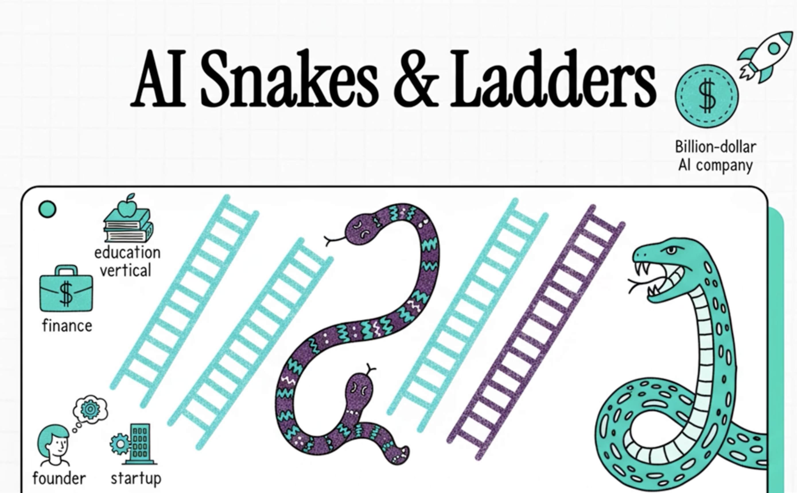

/sp.specify Write chapter 3 in Part 1 of the book. The title of the chapter will be "How to Make a Billion Dollars in the AI Era?". 

The chapter will focus on the opportunities for new developers in the era of AI Driven Development (AIDD) and will will motivate the reader to avail this opportunity. 

The chaper will cover the following material:

## AI's Game of Snakes and Ladders: A Solo Entrepreneur's Blueprint

The links to the following two videos should be included in this video.

**[Video Overview in English](https://youtu.be/axivzX3cu9o)**

**[Video Overview in Urdu/Hindi](https://youtu.be/u-7uAfDZeFc)**

## Executive Summary

This paper outlines a strategy for solo entrepreneurs to achieve significant success, potentially reaching billion-dollar valuations, by exploiting niches within the rapidly consolidating AI industry through the development of vertical agentic solutions. This "Snakes and Ladders" framework posits that success lies in moving beyond the consumer layer to build deep integrations and specialised AI agents for specific fields like finance or education, often using tools like subagents, skills, MCP and Spec-Kit Plus. A validation report confirms the blueprint's high accuracy (95%) and practicality, noting that while the market is dominated by hyperscalers like OpenAI and Google, the strategy is currently feasible for skilled individuals, with proof-of-concept examples already achieving high annual recurring revenue (ARR). The recommended approach, including the Piggyback Protocol Pivot (PPP), advises entrepreneurs to initially partner with incumbents before competing with them using highly efficient, AI-driven operations.

## Introduction

The artificial intelligence landscape is rapidly consolidating around four major players—OpenAI, Google, Anthropic, and Microsoft—but the game is far from over. Understanding the evolving competitive dynamics reveals unexpected opportunities for solo entrepreneurs and small teams to carve out billion-dollar positions in this emerging market.

## The Consumer Layer: A Two-Player Game

History teaches us that most large consumer markets ultimately support only two dominant players. The mobile phone market offers a telling precedent: despite Microsoft's considerable resources and efforts, only Android and iOS survived the consolidation. The third player simply couldn't sustain profitability.

In AI's consumer market, OpenAI has established a commanding lead with 800 million users. Google, leveraging its multimodal capabilities and models like Gemini, appears positioned to capture the second slot. This leaves Anthropic and Microsoft facing a crucial strategic question: how do you win when the consumer game is already spoken for?

## Climbing to the Agentic Layer

Anthropic found its answer, perhaps serendipitously, by ascending to the next competitive layer: agentic AI for software development. With the launch of Claude Code, they didn't just release another coding assistant—they created a new market tier. The numbers tell a remarkable story: within the first two months, Claude Code achieved an annualized revenue run rate of $500 million in the enterprise market.

Google responded swiftly, open-sourcing its technology and offering 1,000 free requests, rapidly acquiring 1 million developer users for Gemini CLI. The battle for the coding agent layer now features two clear leaders: Claude Code at number one, Gemini CLI at number two. Both leverage fine-tuned models and integration with the Model Context Protocol (MCP), creating a formidable barrier to entry.

Meanwhile, Microsoft and GitHub have made their own strategic climb, positioning to compete at an even higher layer by making their tools compatible with all coding agents through products like Spec-Kit.

## The Pattern Emerges: Layer Upon Layer

The software development industry was merely the first domino. This same competitive dynamic—climb the ladder to find your winning layer—will play out across every major industry vertical.

**Finance** is already in play. OpenAI has assembled 100 top analysts to fine-tune models for financial applications. But creating a truly valuable agentic solution requires more than a trained model—it demands deep integration with existing accounting and finance software. The technical challenges of building these integration layers may prove as significant as the AI capabilities themselves.

**Education** shows similar patterns. OpenAI's Study Mode represents an initial move, but without robust connections to educational data layers and learning management systems, its impact remains limited.

The formula for winning in each vertical market requires three elements:
1. Fine-tuned models tailored to domain-specific needs
2. Deep integration with existing industry software and data systems
3. Complete agentic solutions that deliver tangible workflow improvements

## The Rise of the Super Orchestrator

We stand at the threshold of a remarkable phenomenon: the emergence of solo entrepreneurs and single-person unicorns who will be worth billions. These "super orchestrators" won't succeed through traditional scaling of human teams. Instead, they'll leverage AI agents to compete directly with tech giants in specific vertical markets.

This isn't speculative—it's already happening at the foundational LLM layer. Soon it will manifest across every industry niche. The weak players will be eliminated not by large teams, but by these hyper-efficient solo operators.

## The Technical Foundation: Reusable Vertical Intelligence

In the era of AI-driven development, code itself becomes disposable—generated and regenerated on demand. The focus shifts from code reuse to **reusable vertical intelligence**. The fundamental unit of this new paradigm is the **subagent**.

Each Claude Code subagent combines:
- A custom system prompt defining its persona, scope, and domain boundaries
- Horizontal skills (Docker, Kubernetes, infrastructure capabilities)
- Vertical skills (domain expertise in accounting, finance, education, healthcare)
- MCP horizontal connections (integrations with development tools)
- MCP vertical connections (domain-specific APIs and legacy system integrations)

These self-contained, composable subagents become the building blocks of sophisticated agentic architectures. Through spec-driven development and these modular intelligence units, solo entrepreneurs can indeed build world-class vertical solutions that rival those of tech giants.

## The Marketing Challenge: David vs. Goliath

Building world-class technology is only half the battle. How can solo entrepreneurs compete when hyperscalers inevitably enter their chosen vertical markets? Two strategies emerge:

**Strategy One: The Niche Market Approach**
This tried-and-tested method focuses on serving underserved segments too small or specialized to attract major players' attention. It offers sustainability but limited scale.

**Strategy Two: [The Piggyback Protocol Pivot (PPP)](./The%20Complete%20Guide%20to%20Building%20Agentic%20AI%20Startups.pdf)**
This innovative approach offers a more ambitious path:

1. **Create a Standardized Protocol**: Unify disparate vendor APIs in your target industry into a single, elegant protocol
2. **Build Intermediary Infrastructure**: Develop servers that implement this protocol, bridging legacy systems
3. **Layer Intelligent Agents**: Deploy AI agents on top of this unified infrastructure to deliver universal functionality
4. **Leverage Existing Ecosystems**: Market initially through incumbent vendor channels and communities
5. **Execute the Pivot**: Once you've achieved critical mass and proven value, pivot to an independent, AI-native solution

This strategy provides a low-risk entry point into mature markets. You begin by making yourself indispensable to existing players, then gradually shift to competing with them directly—but only after establishing defensible market position.

## The Road Ahead

As we move toward AGI and eventually superintelligence in the coming years, the competitive landscape will continue to evolve in waves. Each industry will see its own "snakes and ladders" game play out, with winners and losers determined by their ability to:

- Identify which competitive layer offers the best opportunity
- Build genuinely useful agentic solutions, not just fine-tuned models
- Create deep integrations that lock in value
- Move quickly while hyperscalers are still focused elsewhere

The critical question for every entrepreneur and technologist isn't whether AI will transform their industry—it's whether they'll be among those single individuals building billion-dollar positions, or whether they'll be phased out by those who do.

The game board is set. The dice are rolling. Which ladder will you climb?

---

## Study Materials:

You should emphasise innovation in your studies because our main goal is innovation. When you study these papers look from the perspective of how it will help you innovate.

[The Piggyback Protocol Pivot (PPP) Strategy: A Strategic Framework for Market Entry and Disruption in Established Industries Through Agentic AI](./Piggyback%20Protocol%20Pivot%20(PPP)%20Strategy.pdf) 

[The Complete Guide to Building Agentic AI Startups: Lean, Design Thinking, and Agile](./The%20Complete%20Guide%20to%20Building%20Agentic%20AI%20Startups.pdf)

