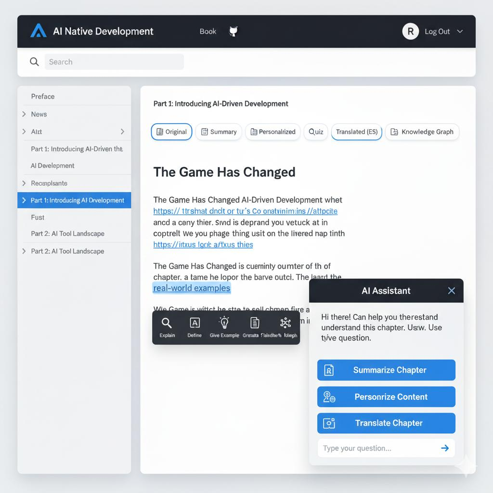
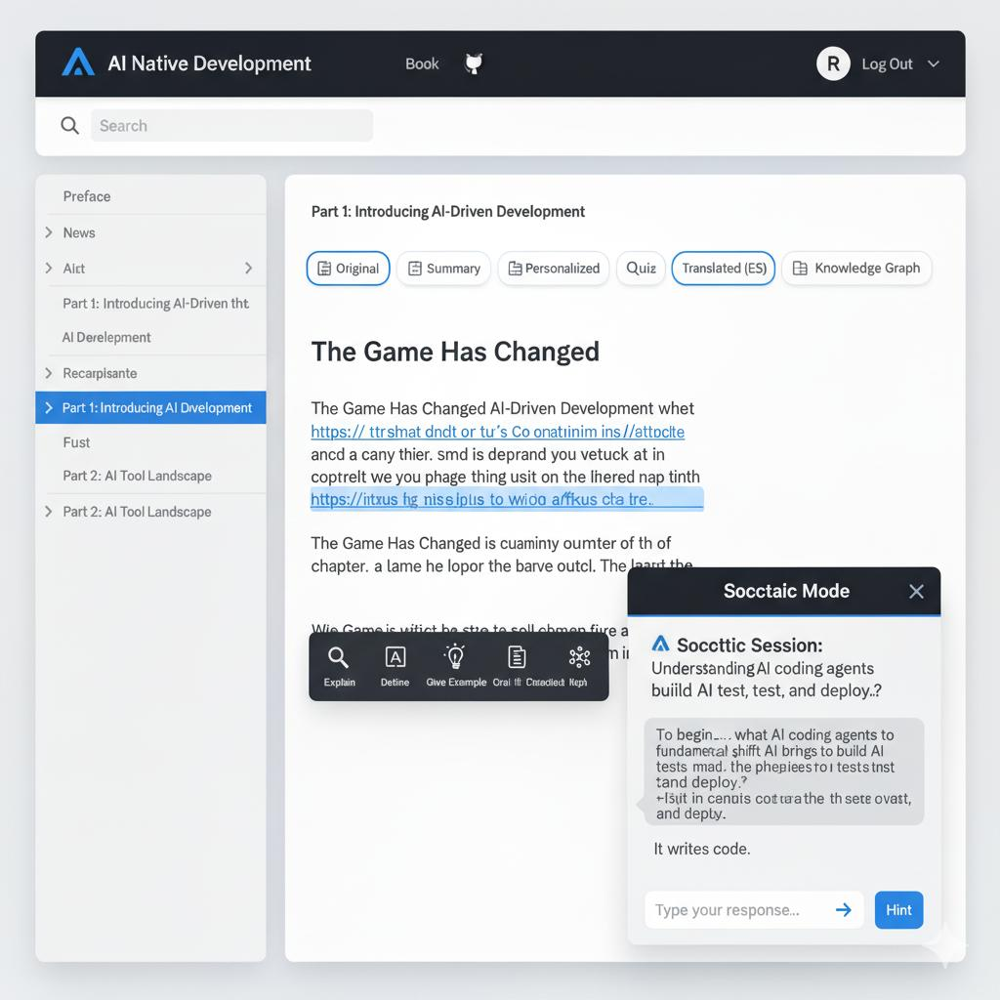

# Specifications for AI Native Software Development Book
**Colearning Agentic AI with Python and TypeScript – The AI & Spec Driven Way**

This repo contains all the specifications for Spec-Kit Plus using Claude Code/Gemini CLI/GPT-5-Codex to write the following complete book.

The book is geared towards teaching beginners how to program Modern Python, TypeScript, and Agentic AI in the new AI Driven Development (AIDD) era.

### Part 1: Introducing AI-Driven Development (4 chapters)
1. The AI Development Revolution: Disrupting the $3 Trillion Software Economy
2. AI Turning Point: The New Wave of AI Coding Agents Has Changed Everything for Developers
3. How to Make a Billion Dollars in the AI Era?
4. The Nine Pillar of AI Driven Development (AIDD)

### Part 2: AI Tool Landscape (4 chapters) 
5. How It All Started: The Claude Code Phenomenon
6. Google Gemini CLI: Open Source and Everywhere
7. Bash Essentials for AI-Driven Development
8. Git & GitHub for AI-Driven Development

### Part 3: Prompt & Context Engineering (2 chapters)
9. Prompt Engineering for AI-Driven Development
10. Context Engineering for AI-Driven Development

### Part 4: Python: The Language of AI Agents (19 chapters)
11. Python UV: Fastest Python Package Manager
12. Introduction to Python
13. Data Types
14. Operators, Keywords, and Variables
15. Strings and Type Casting
16. Control Flow and Loops
17. Lists, Tuples, and Dictionary
18. Set, Frozen Set, and GC
19. Module and Functions
20. Exception Handling
21. IO and File Handling
22. Math, Data Time Calender
23. Object-Oriented Programming Part I
24. Object-Oriented Programming Part II
25. Meta Classes and Data Classes
26. Pydantic and Generics
27. Asyncio
28. CPython and Gil
29. Docstrings and MkDocs

## Part 5: Spec Driven Development (4 chapters)
30. Understanding Spec Driven Development
31. Spec-Kit Plus
32. Building Projects with Spec-Kit Plus
33. The Tessl Vision: Spec-as-Source

## Part 6: AI Native Software Development (16 Chapters)
34. Introduction to AI Agents
* https://www.kaggle.com/whitepaper-introduction-to-agents

35. OpenAI Agents SDK Development using AIDD and SDD
36. Google ADK Development using AIDD and SDD
37. Anthropic Agents Kit Development using AIDD and SDD
38. MCP Fundamentals
39. MCP Server Development using AIDD and SDD
40. Code execution with MCP: Building more efficient agents
* https://www.anthropic.com/engineering/code-execution-with-mcp
* https://www.youtube.com/watch?v=CT4WfKEQY6M

41. FastAPI for Agents (Primer)
Coverage: minimal agent tool endpoint; Pydantic models from your SDD; streaming tokens (SSE/WebSocket) for live agent output; simple API key/JWT; local testing with pytest + httpx.

42. Test-Driven Agent Development (TDD) & Contracts
By this point readers have tools/endpoints and can write tests for:
* tool/skill contracts (Pydantic schemas, argument validation)
* prompt “unit tests” with goldens & mocks
* deterministic runs (seeded responses), regression tests for prompts
* API tests with pytest/httpx fixtures
* property-based tests (Hypothesis) for tool inputs

43. Evals
* We follow with Evals to cover higher-level, task and system-level evaluation, and wire TDD + Evals together in CI/CD (see chapter 54).

44. Building Effective Agents (Design Patterns)

45. Memory & State for Agents
* episodic vs long-term memory
* summarization windows, vector + relational hybrids
* TTL and forgetting

46. Combo Agentic Pattern using AIDD and SDD
Covers: https://github.com/ziaukhan/colearning-agentic-ai-specs/blob/main/chap43_spec_combo.md
47. Vector Databases and RAG for AI Agents
48. Relational Databases for AI Agents
49. Graph Databases and Graph RAG for AI Agents

## Part 7: AI Cloud Native Development with AIDD and SDD (12 chapters)
50. FastAPI for AI Cloud-Native Services with AIDD and SDD (Deep Dive)
* Async I/O, background tasks, streaming (SSE/WebSocket)
* AuthN/AuthZ (API key, JWT), rate limiting patterns
* Validation with Pydantic, error handling, dependency injection
* Testing with pytest/httpx, OpenAPI governance, 12-factor config via env vars (no Docker yet)

51. Docker for AI Services: Building, Shipping, and Running Containers with AIDD and SDD
* Containerize the existing FastAPI app
* Dev vs prod images, multi-stage builds, health checks
* Compose for local stacks (app + Postgres/Redis), env files

52. Apache Kafka for Event-Driven AI Systems with AIDD and SDD
* Add producer/consumer to the same service (e.g., ai-task events)
* Exactly-once/idempotency, retry/DLQ, back-pressure
* Contract testing for events, observability of streams
* An idempotency key pattern (tool invocation id)
* A DLQ drill lab (force a poison message; observe metrics; replay)

53. Kubernetes for AI Services: Orchestrating Containers and Agents
* kubectl-ai
* kagent
* with AIDD and SDD

54. CI/CD & Infrastructure-as-Code for AI Service with AIDD and SDD
* GitHub Actions
* Testcontainers
* Gated deploys with eval thresholds
* Terraform
* env promotion
* migrations

55. Dapr for AI Microservices: Sidecar Building Blocks with AIDD and SDD
* State, Pub/Sub, Service Invocation

56. Dapr Actors for Agentic State and Concurrency with AIDD and SDD
57. Dapr Workflows for Long-Running Orchestration with AIDD and SDD
58. Dapr Agents: Designing Agentic Services on Dapr with AIDD and SDD

59. Observability, Cost & Performance Engineering with AIDD and SDD
* OpenTelemetry traces/metrics/logs across agents, tools, and model calls
* SLOs, error budgets, synthetic checks
* Distributed tracing for agent graphs (spans per tool/prompt), log redaction
* Cost/latency dashboards; saturation & meltdown drills
* caching (semantic + HTTP/Redis)
* batch vs streaming
* early-exit/timeout/hedged requests
* token budgeting

60. API Edge & Gateway for AI Services (Ingress/Kong) with AIDD and SDD
61. Security, Safety & Governance for Agentic Systems
* secret management (Vault/KMS)
* PII handling & redaction
* model/endpoint allow-lists
* prompt-injection defenses
* tool permissioning/sandboxes
* SBOM & supply-chain checks
* Tool sandboxing (constrained subprocess/container for risky tools)
* Prompt-filter / allow-list tests wired into CI (fail the build on new injection vectors)

## Part 8: Turing LLMOps — Proprietary Intelligence (4 chapters)

62. Proprietary Intelligence with Turing: Concepts & Setup
* https://www.turing.com/
* What “proprietary intelligence” means vs off-the-shelf/open.
* Account/project setup, environments, access, and roles.
* Mapping your agent use-cases to Turing primitives.

63. Turing Customization Workflow: Prepare → Fine-Tune → Evaluate
* Light data prep (curation, basic cleaning, safety pass).
* One-click/managed fine-tunes (no deep PyTorch), checkpoints, revert.
* Quality gates: task/safety evals; acceptance thresholds.

64. Deploy & Integrate: Endpoints, SDKs, and Agent Backends
* Deploying models/endpoints; versioning and traffic splits.
* Plugging into your Agents SDK / MCP Servers / FastAPI edge.
* Auth, rate limits, latency/cost guardrails.

65. Operate in Production: Monitoring, Cost, & Governance
* Metrics (latency, errors, tokens), dashboards, alerts.
* Safety monitoring & redaction; incident/rollback playbooks.
* Licensing, model cards, audit trails.

## Part 9: TypeScript: The Language of Realtime and Interaction (5 Chapters)
66. Modern TypeScript Essentials (types, unions, generics, narrowing)
67. Tooling: tsconfig, esbuild/Vite, pnpm/Bun, project structure
68. Async Patterns in TS: Promises, async/await, streams, AbortController
69. Node & Edge Runtimes (Node, Deno, Edge Functions)
70. HTTP, SSE, and WebSockets in TS (clients & servers)
71. Testing in TS (Vitest/Jest) and contract tests

## Part 10: Building Agentic Frontends with OpenAI ChatKit and Next.js (3 Chapters)
72. Building Chat UIs (streaming tokens, tool call visualizers) with OpenAI ChatKit
73. React + Next.js Primer for Agents (server components, actions)
74. Deploy & Preview Environments (Vercel/Netlify patterns)

## Part 11: Building Realtime and Voice Agents (6 Chapters)
75. Realtime APIs (SSE/WebSocket/WebRTC) for agents
76. Browser Audio: capture, VAD, streaming to models
77. TTS/STT pipelines (latency budgets, duplex streams)
78. Multimodal IO (image/screen capture, tools)
79. Mobile & PWA considerations (background, mic perms)
80. Load, Cost, and QoS for Realtime (backpressure, fallbacks)

## Part 12: Agentic AI is the Future
81. Agentic Web: Open (Nanda and A2A) and Closed Garden (OpenAI App and Apps SDK)
82. Agentic Organizations
83. Agentic Commerce

Our sequence flows beautifully from “understanding the AI revolution” → “meeting the tools” → “learning to communicate” → “learning to code in Python” → “learning Spec Driven Development methodology” → “build OpenAI Agents in Python” → “build MCP servers” → “learn to code in TypeScript” → “build realtime and voice agents” → “deploy ai agents”

## Templates

Four Layer/Step Framework Template for teaching AI Native and Cloud-Native topics:
https://claude.ai/share/655df95e-f62d-417f-be1b-71a16ffbf51f

For the Kubernetes it might become 7 layer framework:
1.⁠ ⁠Classic documentation using Command line tool (kubectl) Layer
2.⁠ ⁠⁠kubectl-ai Layer
3.⁠ ⁠⁠kagent Layer
4.⁠ ⁠⁠claude code layer
5.⁠ ⁠⁠Helm charts layer
6.⁠ ⁠⁠subagent and agent skills layer
7.⁠ ⁠⁠SDD Layer

## Design

[10/11/2025, 4:15:58 PM] Zia Khan: https://gemini.google.com/share/dbfc95aec8c1

[10/11/2025, 4:40:07 PM] Zia Khan: Design with react code: https://claude.ai/public/artifacts/dc38c376-3ccb-439c-a855-b44d47a8bdc1
[10/11/2025, 4:43:55 PM] Zia Khan: Design conversation: https://claude.ai/share/35fe6d49-e745-4a34-a1a2-019b69ee1e0e

how to teach in this book using a scoratic method something like openai study more? how to incorporate this in the design?

https://gemini.google.com/share/d446448ff9a8

check this landing page:

https://claude.ai/public/artifacts/2312255d-3697-4b2e-8430-d99017549908