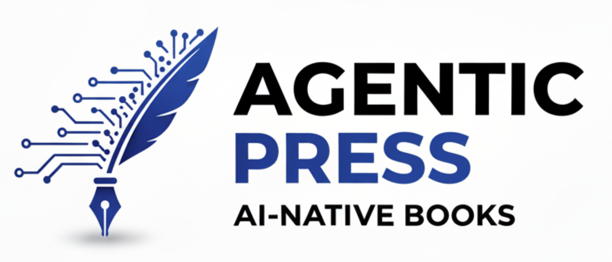

# Agentic Press — Books Built to Think

Domain: agentic-press.ai

[Detailed Business Plan](./business-plan.md)

### One-liner

Agentic Press lets authors and teams create, ship, and update AI-native books that converse, personalize, and stay fresh—with seamless LMS integration.

### 30-sec pitch

Agentic Press is a creation and publishing platform for AI-native books. Authors using the spec-driven methodology design interactive, updatable "living editions" that answer questions, personalize learning paths, and connect to real data. Publish once to web and mobile readers, integrate directly into any major LMS (Canvas, Moodle, Blackboard, Google Classroom), then improve continuously—no reprints required. Books as a service, classroom-ready.

### Detailed pitch

Agentic Press is an innovative platform that empowers authors to create dynamic, AI-powered "living books" using a spec-driven authoring methodology. These books go beyond static text: they interactively answer reader questions, adapt learning paths based on individual needs, integrate real-time data from external APIs (e.g., weather, stock prices, or educational databases), and evolve over time. Authors publish once to responsive web and mobile formats, with seamless embedding into major learning management systems (LMS) like Canvas, Moodle, Blackboard, and Google Classroom via standards such as LTI 1.3 or custom APIs. This "books as a service" model eliminates the need for reprints—updates propagate instantly through Git-based versioning, enabling continuous improvement based on reader feedback or new insights. Ideal for educators, trainers, and content creators, Agentic Press democratizes interactive publishing, fostering engaging, personalized experiences in classrooms, corporate training, or self-paced learning. Monetization options could include subscription tiers for premium features, per-book licensing, or affiliate integrations with data providers.

### Visual identity (quick directions)

* **Logo idea:**

  1. Neural quill (pen nib + node/edge network).
  2. Page-turn “A” monogram with subtle circuit traces.
  3. Speech-bubble book mark.
* **Palette:** Deep ink #0B0F1A, Electric accent #5B8CFF, Soft page #F5F7FB, Success mint #36D399.
* **Type:** Headline—Inter or Satoshi (bold, geometric). Body—Source Sans 3 or Inter (regular). Rounded corners, subtle shadows, high contrast.

### Product/feature naming

* **Agentic Press Studio** (authoring)
* **Agentic Press Reader** (web/mobile reader)
* **Agentic Press Shelf** (storefront/distribution)
* **Agentic Press Connect** (LMS integration hub)
* **Living Editions** (our book format)
* **Co-Teacher** mode (guided tutoring inside books)

### Homepage hero (plug-and-play)

**Headline:** Books built to think.
**Subhead:** Create AI-native, update-on-the-fly editions that answer questions and adapt to every reader.
**CTA:** Start a Living Edition →  **Secondary:** Explore sample books →

### 50-word “About”

Agentic Press is the platform for AI-native books. Authors and publishers design interactive, data-aware editions that personalize learning, answer questions, and evolve after launch. Publish to web and mobile, integrate models and tools safely, and keep content evergreen with continuous updates, analytics, and versioning.

### LLM connectivity

**Model-agnostic architecture:**
* Connect to OpenAI (GPT-5), Anthropic Claude (Opus, Sonnet), Google Gemini, Meta Llama, Mistral, and more
* **Reader's Choice:** Let readers select their preferred LLM for personalized interactions and bring their own API Keys
* **Fallback chains:** Automatically switch models for cost optimization or availability
* **Hybrid mode:** Route queries to specialized models (code to GPT-5, reasoning to Claude Code, etc.)
* **Unified API:** Authors write once, deploy across all models without rewriting prompts
* **Model comparison:** A/B test responses across LLMs to optimize book experience

### LMS Integration

**Seamless Classroom Integration:** Living Editions plug directly into Canvas, Moodle, Blackboard, Google Classroom, and other major LMS platforms via LTI 1.3 standard. Automatically sync progress, pass back grades, embed interactive content as assignments, and let instructors track student engagement—all without leaving their existing workflow.

**Key capabilities:**
* Instructors customize books for their classes
* Single sign-on (SSO) for students and instructors
* Grade passback and progress tracking
* Assignment integration with due dates
* Engagement analytics dashboard for educators
* Roster sync and course mapping
* White-label embedding inside LMS course pages

## Agentic Press: Technical Implementation

The **Agentic Press Reader (web/mobile reader)** builds on top of Docusurus, GitHub and Github Pages. The AI Components in the reader are React based with a FastAPI OpenAI Agents SDK backend with a Serverless Postgres Neon datastore. The backend will be running on Google Kubernetes Engine (GKE). 

**The Agentic Press Studio (authoring)** is a multi-tanent cloud platform for book authors. The front-end is built with OpenAI Chatkit, Novel.sh and Next.js. Just like the Claude Code on the web it lets you kick off coding sessions without opening your terminal. It connects to your GitHub book repository, describe and specify what should be in the book (Spec-Driven Writing), and studio handles the book writing.

Each studio session runs in its own isolated environment (GKE Pod Snapshots) with real-time progress tracking, and you can actively steer studio to adjust course as it’s working through the chapters.

The studio backend will be running in GKE and will be using GKE Pod Snapshots with FastAPI, Claude Code, and Spec-Kit Plus running in the container. GKE Pod Snapshots allows us to snapshot the in-memory state of running pods/containers (including CPU and GPU workloads), effectively "freezing" Claude Code session when the author is not using the studio, and then restore/rewaken them almost instantly from the snapshot when the author starts using the studio. The studio will be updating the book github repository.

### Note GKE Pricing

We are using it because of latest fuctionality: GKE Pod Snapshots and GKE Agent Sandbox: 

https://grok.com/share/bGVnYWN5_d4b031ab-bca9-4d5f-ba5c-398c8f10f74a 

https://grok.com/share/bGVnYWN5_0484c4b5-597b-4700-a6ce-7a189500ef73

https://cloud.google.com/kubernetes-engine/pricing?hl=en

It offers a monthly free tier credit that effectively makes certain clusters free or very low-cost for light usage.

GKE Free Tier Details (as of November 2025)

* $74.40 in monthly credits per billing account (resets every month, no rollover).
* This credit fully covers the cluster management fee ($0.10/hour ≈ $73–74/month for a full month) for one of the following:
* One zonal Standard cluster (single-zone).
* One Autopilot cluster (any topology).

Applies only to zonal Standard and Autopilot clusters. 

Regional clusters, additional clusters, or GKE Enterprise features do not qualify for the credit.

The credit covers only the control plane / management fee — not the cost of running actual workloads (pods, nodes, storage, networking, etc.).

### Key Takeaways

* You can run one idle GKE cluster completely free forever (as long as you stay within one eligible zonal/Autopilot cluster per billing account).

* As soon as you deploy real workloads (especially in Autopilot), you pay normal pay-as-you-go rates for the resources those pods consume — there is no free compute quota beyond the management credit.

* New Google Cloud accounts also get a **$300 one-time trial credit (valid for 90 days)** that can cover heavier usage during signup.